# 올리캐쳐 🎪

가상 인형뽑기 모바일 웹 앱. [Claude Design 스펙](https://claude.ai/design/p/50af7299-f0de-4723-9187-689b4723547f)의
47개 화면을 실제로 동작하는 앱으로 구현했습니다.

빌드 도구·프레임워크·의존성 없이 정적 파일만으로 돌아갑니다.

## 미리보기

<p>
  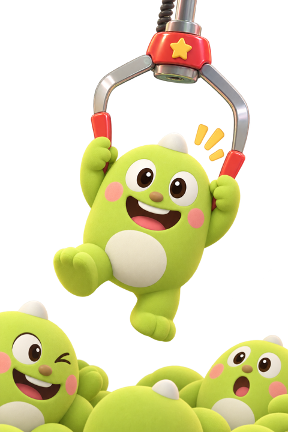
  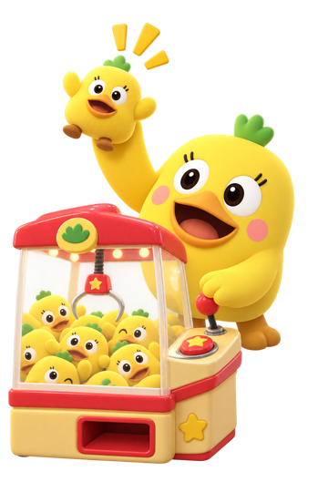
</p>

왼쪽은 온보딩 첫 화면, 오른쪽은 홈의 데일리 미션 카드에 쓰이는 캐릭터입니다.
인형은 `dolls/`에 들어 있습니다. 기본 6종은 SVG 한 장이고, 마스코트 올리·원이 11종은
플레이 순간마다 포즈가 바뀌는 4장짜리입니다.

### 포즈 시트 자르기

4포즈가 2×2로 한 장에 들어 있는 시트는 아래 스크립트로 잘라 넣습니다.
알파 채널에서 빈 행·열을 찾아 격자선을 잡고, 각 칸을 그림 경계에 맞춰 다듬습니다.

```bash
python3 tools/split_sheet.py <시트.png> dolls/<인형id>
```

`<인형id>-idle.png` / `-grabbed.png` / `-drop.png` / `-win.png` 네 장이 나옵니다.
시트는 **배경이 투명한 PNG**여야 합니다 — 체커보드가 픽셀로 구워진 스크린샷은 잘리지 않습니다.

<p>
  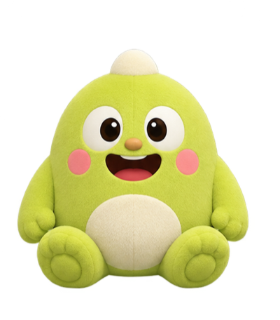
  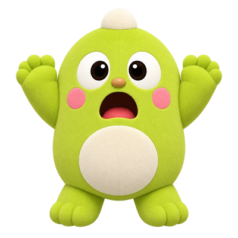
  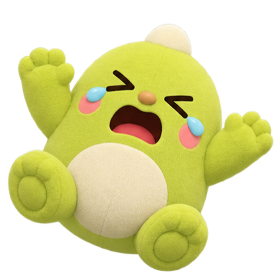
  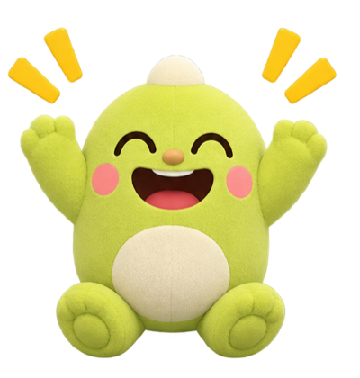
</p>

<p>
  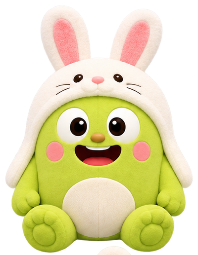
  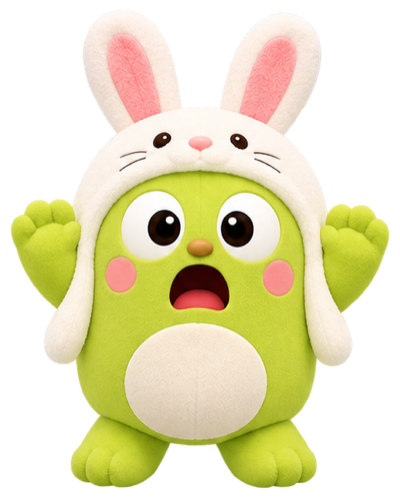
  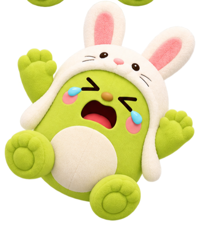
  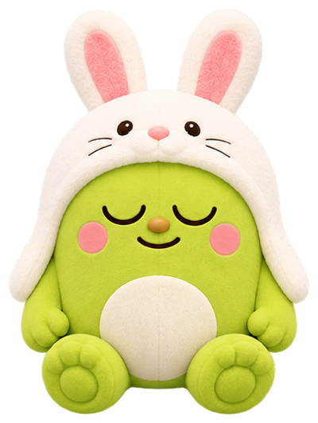
</p>

시즌 인형 9종(`js/data.js`의 `poseDolls()`)도 같은 4포즈 규칙을 씁니다.

<p>
  
  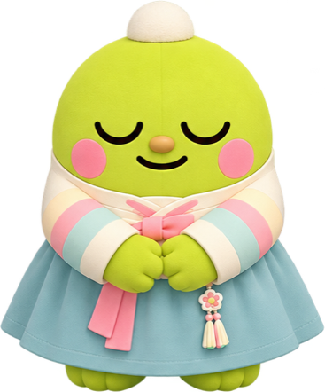
  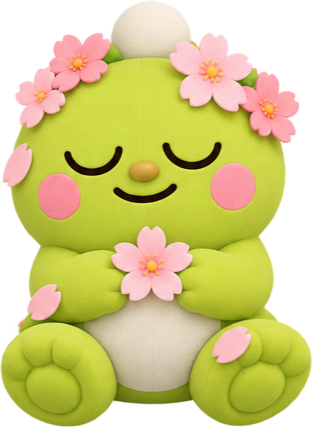
  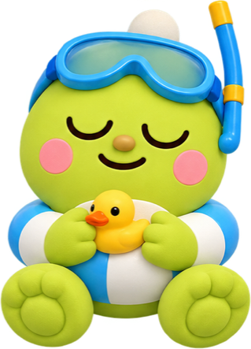
  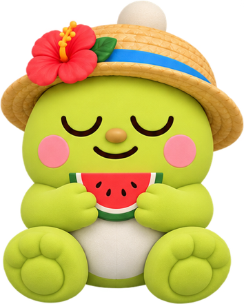
  
  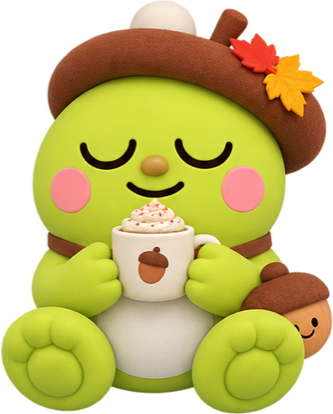
  
  
</p>

<p>
  
  
  
  
  
  
</p>

## 실행

### 1. 내려받기

```bash
git clone https://github.com/Feelconomy/ally-catcher.git
```

이 브랜치를 보려면 클론 후 브랜치를 바꿔주세요.

```bash
cd ally-catcher && git checkout yuyu
```

### 2. 로컬 서버 띄우기

설치할 것도, 빌드할 것도 없습니다. 정적 파일이라 아무 웹 서버나 됩니다.

```bash
python3 -m http.server 8080
```

Node가 편하면 이것도 됩니다.

```bash
npx serve -l 8080
```

### 3. 접속

브라우저에서 아래 주소로 들어가면 됩니다.

```
http://localhost:8080
```

**모바일 화면으로 보기** — 데스크톱 브라우저에서는 화면이 가운데 정렬된 375×812 프레임으로 보입니다.
실제 모바일 감각으로 확인하려면 개발자 도구(F12) → 기기 툴바(⌘⇧M / Ctrl+Shift+M) → iPhone 계열을 선택하세요.

**실제 휴대폰에서 보기** — 맥과 폰이 같은 와이파이에 있어야 합니다. 맥의 IP를 확인한 뒤

```bash
ipconfig getifaddr en0
```

폰 브라우저에서 `http://<맥 IP>:8080` 으로 접속하면 됩니다.

> ⚠️ `index.html`을 파일 탐색기에서 더블클릭해서 여는 방식(`file://`)은 권장하지 않습니다.
> 브라우저가 로컬 파일의 `localStorage`를 제한할 수 있어 티켓·인형이 저장되지 않을 수 있습니다.
> 반드시 위처럼 서버를 띄워서 `http://` 로 접속하세요.

### 테스트 도구 (이스터 에그)

홈 화면의 **`올리캐쳐` 로고를 3초 안에 5번** 누르면 숨겨진 테스트 패널이 열립니다.

- **티켓 임의 충전** — 1~999장까지 원하는 만큼
- **온보딩 처음부터 보기**

티켓은 원래 미션·출석으로만 모이는 재화라 실제 서비스에는 없어야 할 메뉴입니다. 테스트 편의용으로만 숨겨두었습니다.

## 구조

```
index.html          앱 셸 (스크립트/스타일 로드만)
css/
  tokens.css        디자인 토큰 — 컬러·라운드·그림자·모션
  app.css           컴포넌트 + 화면 스타일
js/
  icons.js          아이콘 43종 (인라인 SVG)
  data.js           기계·인형·미션·추첨 카탈로그
  store.js          플레이어 상태 + localStorage 영속화
  ui.js             렌더 헬퍼, 상단바/탭바, 오버레이 레이어
  overlays.js       바텀시트·다이얼로그
  play.js           집게 게임 (화면 03)
  screens.js        나머지 전체 화면
  app.js            해시 라우터 + 부팅
dolls/              인형 아트 — SVG 6종 + 올리·원이 11종 각 4포즈 PNG
tools/              포즈 시트 분할 스크립트
assets/             캐릭터 일러스트 — ollie.png (온보딩), wonhee.png (미션 카드)
```

## 디자인 시스템

스펙의 Wanted 디자인 시스템에서 가져온 값들:

| 토큰 | 값 | 쓰임 |
|---|---|---|
| `--green` | `#00A650` | 브랜드, 주 버튼, 활성 탭 |
| `--yellow` | `#FFD400` | 강조, 집게, 티켓 |
| `--cream` | `#FFFBEF` | 앱 배경 |
| `--canvas` | `#F3F1EA` | 앱 바깥 배경 |
| `--ink` | `#171717` | 본문 텍스트, 다크 카드 |
| `--dark` | `#141414` | 플레이 화면 |

- 서체는 **Pretendard** (CDN, 시스템 폰트 폴백)
- 아이콘 43종 중 21종은 디자인 시스템 번들에서 추출, 나머지 22종은 같은 규격(24×24, `currentColor`, 솔리드 필)으로 직접 작성.
  번들이 256KiB에서 잘려 나머지를 받을 수 없었습니다.

## 화면

스펙의 번호를 그대로 따릅니다.

**진입** 09 스플래시 · 10 로그인 · 11 약관 · 12 프로필 · 13 알림 권한 · 01 온보딩 · 14 가입 티켓
**메인 탭** 02 홈 · 06 미션 · 05 보관함 · 08 마이
**탐색** 16 검색 · 17 결과 없음 · 18 기계 상세 · 19 점검중
**플레이** 20 진입 로딩 · 03 플레이 · 04 성공 · 22 실패 · 21 티켓 부족 · 23 연결 끊김 · 24 나가기 확인 · 25 코치마크
**수집** 26 빈 보관함 · 27 인형 상세 · 28 중복 교환 · 29 도감
**재화** 30 광고 시청 · 31 미션 완료 · 32 보상 획득 · 07 교환소 · 33 추첨 응모 · 34 포인트 부족
**NH멤버스** 35 연동 · 36 전환중 · 37 완료 · 38 실패
**설정** 39 설정 · 40 알림 설정 · 41 응모 내역 · 42 탈퇴
**시스템** 43 네트워크 오류 · 44 점검 · 45 강제 업데이트 · 46 토스트/스낵바

각 화면은 해시 라우트로 직접 열 수 있습니다: `#home`, `#play/bear3`, `#exchange`, `#settings` 등.

## 게임 규칙

스펙에 적힌 수치를 그대로 씁니다.

- **티켓** 가입 3장. 현금 구매 불가 — 미션·출석·광고로만 획득 (스펙 06/21번 화면 문구)
- **플레이 비용** 기계별 1~3장, 20초 제한
- **성공률** 기계 기본값(22~44%)에 조준 정확도를 곱하고, 연속 실패마다 **+8%** (최대 90%)
- **포인트** 인형 등급별 적립 — N 60P / R 120P / SR 400P
- **중복 교환** 같은 인형이 2개 이상이면 1개를 포인트로 교환 (되돌릴 수 없음)
- **NH멤버스 전환** 100P → 80멤버스P, 최소 1,000P, 00:00~04:00 점검 시간에는 실패 처리

조작은 좌우 레버 하나와 `집게 내리기` 버튼. 키보드는 ←→ + 스페이스.
크레딧당 집게는 한 번만 내려가고, 잡아도 올리다가 미끄러지거나 옮기다 떨어뜨릴 수 있습니다.

## 데이터

플레이어 상태는 전부 `localStorage`(`ppopgiwang.v1`)에 저장됩니다. 서버가 없으므로
티켓·포인트 원장은 [store.js](js/store.js)에서만 강제됩니다 — 실제 서비스로 갈 땐
뽑기 판정과 재화 적립을 서버로 옮겨야 합니다.

설정 → 회원 탈퇴로 초기화할 수 있습니다.

## 캐시

정적 자산은 `?v=N` 쿼리로 버전을 붙입니다 ([index.html](index.html)).
CSS나 JS를 고쳤는데 브라우저에 반영되지 않으면 이 숫자를 올리세요.
